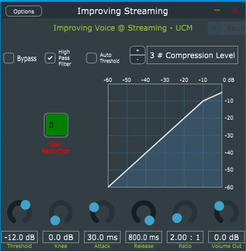

# Improving Streaming

## This readme differs slightly from the one provided on github.

# https://github.com/ealcober/Improving-Streaming.git

Code based on (1) Rudrich SimpleCompressor and (2) Alermi pd-HighPass for academic research looking for relations between compression and equalization and voice intelligibillity.

### Purpose
The purpose of this project is to develop a digital audio processor, based on traditional signal enhancement tools. We will broadcast voice through it, and variations detected on voice intelligibility will be studied, looking for relations within different configuration parameters applied, creating an objective process to measure its impact.

### What can I find in this folder?

1. \CodigoPlugin\bin\ 
### contains binary files compiled for x64 with VST2 SDK

2. \CodigoPlugin\Improving Streaming\examples\ImprovingStreaming\ImprovingStreaming.jucer
   \CodigoPlugin\Improving Streaming\examples\ImprovingStreaming\Source

### this is the file you must open with JUCE: Projucer Project File and the place where you can find both main project files: Editor & Processor

3. \DocumentosAnejosMemoria\Desarrollo\Mockups\
### contains some initial design ideas as mockups: brainstorm at first stages of developing

4. \DocumentosAnejosMemoria\Desarrollo\Screenshots
### you can find how finally Improving Streaming looks :)

5. \DocumentosAnejosMemoria\Experimentos
### organized by folders & sub-folders camelCase named in Spanish, you can find there

5.1. DocumentosAnejosMemoria\Experimentos\BrutosyAudiosSpeechToTextConResultados
### videos of live recording via twitch of recorded voice during this TFG experiments, first, and second of them
### google and microsoft speech to text services transcriptions per audio file
### dwdiff linux command output to compare bypass recognized text with the text recognized wich each preset

5.2. \DocumentosAnejosMemoria\Experimentos\ScriptsConResultadosSTOI
### Matlab Scripts used on each experiment for STOI calculation and results pasted as comment

5.3.DocumentosAnejosMemoria\Experimentos\VideosCuencoGoogleTeams
### Some recordings tryng to test auto configurable IA noise cancellation sollutions from Google & Microsoft with a Tibetan bowl

This repository includes:
- Code for *IMPROVING AUDIO QUALITY IN STREAMING APPLICATIONS* TFG.
- Additional Scripts used during development
- Original videos and audios of both experiments
- Step by Step guide to finally build your own DLL VST2 or EXE as Standalone App
- SDK for VST 2.0 development vstsdk3610_11_06_2018_build_37.zip file
	- Its an special version, not actually availabe as public dowload cause its recent update to VST3.0 SDK

### References
1. https://github.com/DanielRudrich/SimpleCompressor
2. https://github.com/alermi/pd-HighPass

### Screenshot of the ImprovingStreaming plug-in

### Instructions for Compiling and usage with OBS:
1. Can be foud @ "step by step compile and obs usage guide.pptx" file

2. If you prefer use binaries to avoid risky places, just skip compiling part and go to OBS audio insertion step by step guide

